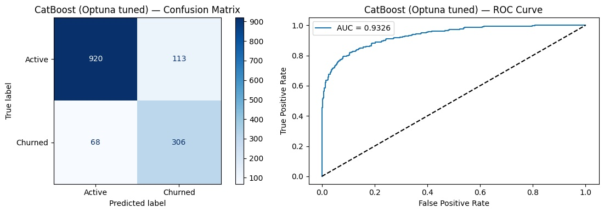
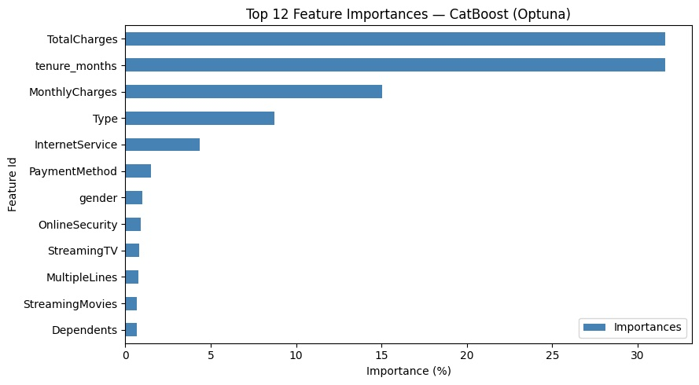

# 📡 Interconnect — Customer Churn Prediction


> **Predicting customer cancellation before it happens** — binary classification model for Interconnect Telecom, achieving ROC AUC **0.9326** (target: 0.88 ✅).

---

## 📋 Table of Contents

- [Business Problem](#-business-problem)
- [Project Structure](#-project-structure)
- [Dataset](#-dataset)
- [Methodology](#-methodology)
- [Results](#-results)
- [How to Run](#-how-to-run)
- [Key Findings](#-key-findings)
- [Next Steps](#-next-steps)

---

## 💼 Business Problem

Customer churn is one of the core strategic challenges for telecom companies. It directly impacts recurring revenue and raises customer-acquisition costs.

**Business question:** *"Can we identify, in advance, customers most likely to cancel — based on contractual, demographic, and service data?"*

The model outputs a **churn probability score per customer**, enabling the retention team to prioritise high-risk profiles before they cancel.

---

## 📁 Project Structure

```
INTERCONNECT-CUSTOMER-CHURN/
│
├── data/
│   ├── contract.csv          # Contract type, billing, payment method
│   ├── personal.csv          # Demographics (gender, senior, dependents)
│   ├── internet.csv          # Internet service and add-ons
│   └── phone.csv             # Phone service features
│
├── notebooks/
│   ├── catboost_info/        # CatBoost training logs (auto-generated)
│   └── churn_prediction.ipynb  # ← Main unified notebook
│
├── interconnect_env/         # Virtual environment (not tracked by git)
│
├── .gitignore
├── requirements.txt
└── README.md
```

---

## 📊 Dataset

| Property | Value |
|---|---|
| Source | Interconnect Telecom (internal) |
| Customers | ~7,043 |
| Tables | 4 CSV files joined via `customerID` |
| Target | `churn` — binary (0 = active, 1 = cancelled) |
| Class distribution | 73% active / 27% churned |
| Date range | 2013 – Feb 2020 |

**Data quality issues resolved:**

| Issue | Resolution |
|---|---|
| `TotalCharges` stored as string | Converted to `float64` |
| Dates stored as strings | Converted to `datetime64` |
| Missing service columns (NaN) | Filled with `'No'` (no service subscribed) |
| Missing `TotalCharges` (11 rows) | Removed (<0.2% of data) |

---

## 🔬 Methodology

### Feature Engineering
- **`tenure_months`** — time as a customer in months, calculated as `(reference_date − BeginDate) / 30.44`. This became the **#1 most important feature**.

### Models Trained

| Model | Approach |
|---|---|
| `DummyClassifier` | Baseline — always predicts majority class |
| `LogisticRegression` | Linear model inside sklearn `Pipeline` + `StandardScaler` |
| `CatBoostClassifier` | Gradient boosting with manual hyperparameter tuning |
| `CatBoostClassifier` | **Bayesian hyperparameter optimisation via Optuna** (30 trials, 3-fold CV) |

### Evaluation Helpers
Two reusable, production-oriented functions centralise all evaluation logic:
- **`evaluate_model()`** — classification report, confusion matrix, ROC curve
- **`cross_validate_model()`** — stratified K-Fold cross-validation (mean ± std AUC)

---

## 📈 Results

| Model | ROC AUC |
|---|---|
| DummyClassifier | 0.5000 |
| Logistic Regression | 0.8249 |
| CatBoost (manual tuning) | 0.9172 |
| **CatBoost (Optuna)** | **0.9326** ✅ |

**Best model — CatBoost (Optuna) on test set:**

| Metric | Value |
|---|---|
| ROC AUC | **0.9326** |
| Accuracy | 87% |
| Recall (churn) | 79% |
| F1-score (churn) | 0.76 |

**Top 5 features by importance:**
1. `TotalCharges` (~32%)
2. `tenure_months` (~32%)
3. `MonthlyCharges` (~15%)
4. `Type` — contract type (~9%)
5. `InternetService` (~4%)

---

## 🖼️ Visuals

**Confusion Matrix & ROC Curve — CatBoost (Optuna)**



**Feature Importances — CatBoost (Optuna)**



---

## 🚀 How to Run

### 1. Clone the repository

```bash
git clone https://github.com/<your-username>/interconnect-customer-churn.git
cd interconnect-customer-churn
```

### 2. Create and activate the virtual environment

```bash
python -m venv interconnect_env

# macOS / Linux
source interconnect_env/bin/activate

# Windows
interconnect_env\Scripts\activate
```

### 3. Install dependencies

```bash
pip install -r requirements.txt
```

### 4. Launch Jupyter

```bash
jupyter notebook notebooks/churn_prediction.ipynb
```

> **Note:** The notebook is configured to run from the `/notebooks` directory. If moving it, update the `BASE_PATH` variable at the top of the notebook accordingly. When running on TripleTen's platform, set `BASE_PATH = '../data/'`.

---

## 🔑 Key Findings

- **Tenure is the dominant predictor** — customers in their first 6 months churn at a dramatically higher rate than long-term customers.
- **No seasonal pattern detected** — monthly churn rate analysis shows the pattern is driven by cohort tenure, not calendar time.
- **Contract type matters** — month-to-month customers churn far more than those on annual/two-year contracts.
- **Bayesian optimisation (Optuna) outperforms manual tuning** — +0.015 AUC improvement with 30 automated trials.
- **Class imbalance (27% churn) was handled via `class_weights`** — SMOTE was not necessary given the moderate imbalance.

---

## 🔭 Next Steps

- [ ] Add cross-validation scores to final model comparison table
- [ ] Threshold tuning (optimise for precision/recall trade-off based on campaign budget)
- [ ] Enrich dataset with usage volume data (traffic, call minutes)
- [ ] Wrap model in a REST API (FastAPI) for CRM integration
- [ ] Set up MLflow experiment tracking for model versioning
- [ ] Schedule quarterly retraining pipeline with data drift monitoring

---

## 🎓 Context

This project was developed as the **final capstone** of the [TripleTen](https://tripleten.com) Data Science programme.

---

## 📄 License

This project is for educational purposes. Dataset provided by TripleTen / Interconnect (fictional telecom company).

---

## 🤝 Contact
[](https://www.linkedin.com/in/phaa/)